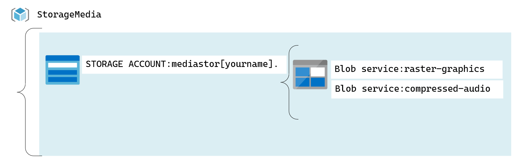

#  Lab 03: Recuperación de metadatos y recursos de Azure Storage mediante el SDK de Azure Storage para .NET

##  Escenario de laboratorio

Se está preparando para alojar una aplicación web en Microsoft Azure que utiliza una combinación de gráficos vectoriales y ráster. Como grupo de desarrollo, su equipo ha decidido almacenar cualquier contenido multimedia en Azure Storage y administrarlo de forma automatizada mediante el uso de código C# en .NET. Antes de comenzar este importante hito, decidió tomarse un tiempo para aprender la versión más reciente del SDK de .NET que se usa para acceder al almacenamiento mediante la creación de una aplicación simple para administrar y enumerar blobs y contenedores.

## Objetivos
Después de completar esta práctica de laboratorio, podrá:

- Crear contenedores y cargar blobs mediante Azure Portal.
- Enumerar blobs y contenedores con el SDK de almacenamiento de Microsoft Azure para .NET.
- Extraer metadatos de blob con el SDK de almacenamiento.

## Arquitectura

