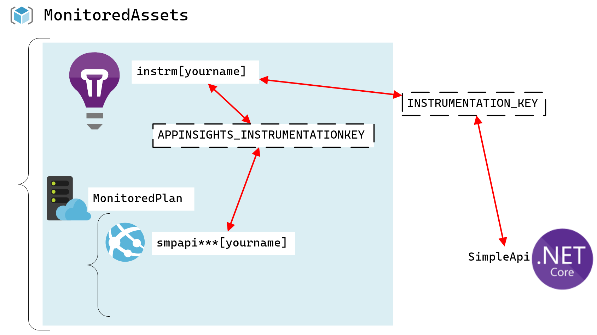

# Lab: servicios de supervisión que se implementan en Azure

## Escenario de laboratorio

Ha creado una API para su próxima gran startup. A pesar de que desea llegar al mercado rápidamente, ha sido testigo de cómo fracasan otras empresas cuando no planifican su crecimiento y tienen muy pocos recursos o demasiados usuarios. Para planificar esto, ha decidido aprovechar las características de escalamiento horizontal de Microsoft Azure App Service, las características de telemetría de Application Insights.

## Objetivos

Después de completar esta práctica de laboratorio, podrá:

- Crear un recurso de Application Insights.

- Integrar el seguimiento de telemetría de Application Insights en una aplicación web ASP.NET y un recurso creado con Web Apps de Azure App Service.

## Arquitectura

