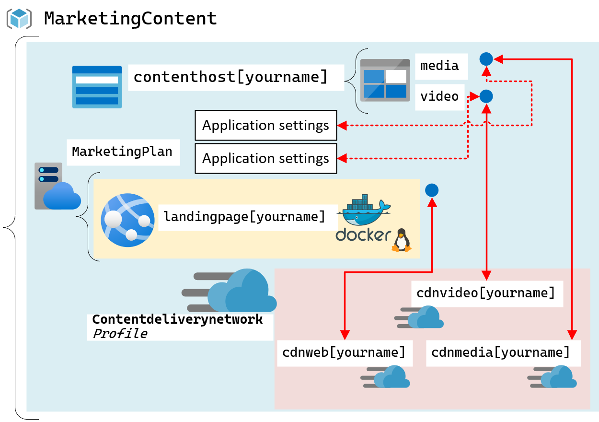

# Lab: Mejora de una aplicación web mediante el uso de Azure Content Delivery Network

## Escenario de laboratorio
Su departamento de marketing tiene la tarea de crear una página de inicio de sitio web para alojar contenidos sobre un próximo curso de edX. Al diseñar el sitio web, su equipo ha decido que los videos multimedia y el contenido de imágenes serían la forma ideal de transmitir su mensaje de marketing. El sitio web ya está completo y disponible mediante un contenedor Docker, y su equipo también decidió que le gustaría utilizar una red de entrega de contenido (CDN) para mejorar el rendimiento de las imágenes, los videos y el sitio web en sí. Se le ha asignado la tarea de utilizar Microsoft Azure Content Delivery Network para mejorar el rendimiento del contenido estándar y transmitido en el sitio web.

## Objetivos
Después de completar esta práctica de laboratorio, podrá:

- Registrar un proveedor de recursos de Microsoft.CDN.

- Crear recursos de la red de distribución de contenido.

- Crear y configure puntos de conexión de Content Delivery Network que estén vinculados a varios servicios de Azure.

## Arquitectura

